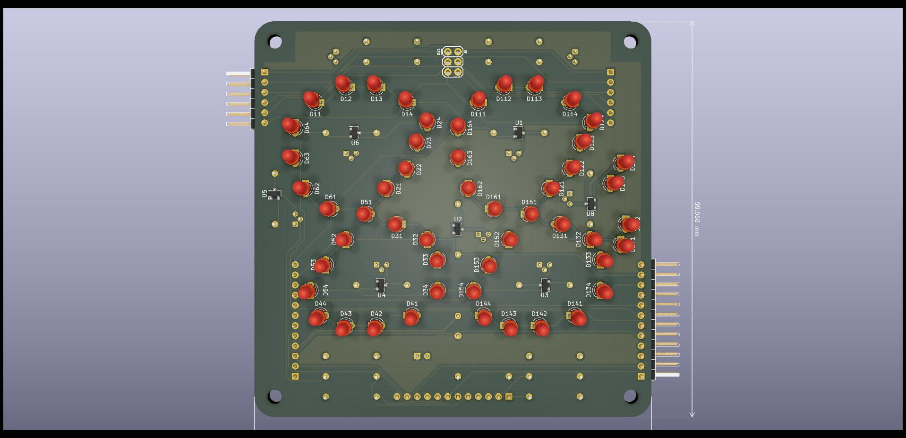

# 6 segment 2 digit board

These are the Kicad design files for the [6 segment 2 digit board](https://hackaday.io/project/175397-6-segment-2-digit-led-board) project. Up to 3 boards can be cascaded for 6 digits.

This is a multiplexed design with 6 cathode segment drive lines (one colon line is unused), and up to 6 anode digit drive lines. The cathode drive lines are taken high to turn on the transistors, while the anode drive lines are taken low to turn on the transistors.

## Versioning

Release October 2020

## Notes

Most components are installed on the back side and the LEDs are installed on the front side.

The NPN transistors need a gain > 20 and the PNP transistors need a gain > 40. A bit more margin is recommended.

Note the the LED supply voltage will need to be higher than 4x the LED drop and the cathode current limiting resistor should be calculated accordingly. So 5V will not be sufficient and also a buffer stage will be needed for most MCUs. For example with a 12V supply and green (not emerald) LEDs, the voltage drop per LED is 2V. The transistor drops will be around 0.8V. That leaves 2.2V to be dropped across the resistor. A 220Ω resistor gives 10mA through the LED. For 4 digits multiplexed this is effectively 2.5mA. Modern LEDs are efficient enough to shine brightly at such currents. For dimming, use PWM.

When cascading only one board needs to be fully populated. The (up to 2) others only need the LEDs, the anode driver transistors, and its resistors. Also the PNP transistor base drive resistor leads are extended to fit the anode drive line connector holes for the digit select, starting with pin 1 for the leftmost digit.

The schematic shows cathode current limiting resistors in parallel with TM1810 constant current ICs. Only one needs to be installed. Only TM1810-30 was available to me and 30mA is too high a current for 3mm LEDs, even multiplexed so I stuck with the resistors.

## Authors

* **Ken Yap**

## License

See the [LICENSE](LICENSE.md) file for license rights and limitations (MIT).
